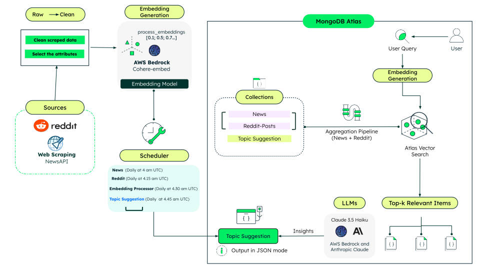

# **Content Lab - Automated Content Analysis & Suggestion Engine**

This repository hosts the backend for the ContentLab - Automated Content Analysis & Suggestion Engine service. The service uses FastAPI to deliver content suggestions, including semantic search, automated content aggregation, and AI-generated insights. It uses MongoDB for scalable storage and vector search, with scheduled jobs for continuous data ingestion and analysis. Designed for content creators and analysts, it transforms raw news and social media data into actionable, searchable intelligence.

## **Architecture Overview**

This backend is designed as a microservice, focusing on automated content analysis, aggregation, and AI-powered suggestions. Each component is modular, enabling independent scaling, maintenance, and integration with other services.

### Core Structure:

- **FastAPI Application:**  
  The main entry point (`backend/main.py`) serves as the API gateway for all backend operations. It exposes REST endpoints for content retrieval, semantic search, user management, and AI-driven insights. FastAPI ensures high performance, automatic documentation, and easy integration with other microservices.

- **Database Layer:**  
  The MongoDB connector (`backend/db/mdb.py`) abstracts all database interactions. It manages connections, queries, and CRUD operations for collections such as `news`, `reddit_posts`, `suggestions`, `drafts`, and `userProfiles`. This layer ensures data consistency and scalability, supporting high-throughput ingestion and retrieval.

- **API Routes:**  
  Modular routers in `backend/routers/` separate concerns for different functionalities. Each router handles specific endpoints, making the codebase maintainable and extensible. This structure supports microservice best practices by isolating business logic.

- **Background Processing:**  
  Automated data collection is handled by schedulers and scrapers. These run as background jobs, ingesting news and social media data at scheduled intervals. This ensures the microservice remains up-to-date with the latest content without manual intervention.

- **AI/ML Components:**  
  Integration with AWS Bedrock enables advanced AI capabilities, such as semantic embeddings and content analysis. These components process raw data into actionable intelligence, supporting features like semantic search and automated suggestions.

## **High Level Architecture**



### **Suggestion Engine Workflow**

The **Suggestion Engine** serves as a smart topic suggestion tool that analyzes user queries, gathers relevant data from news and social media, and presents actionable insights. Here’s a complete overview of the workflow from query to response:

### Overview

1. **Data Ingestion:**  
   - Scraped data from news and Reddit is ingested and stored in MongoDB collections (`news`, `reddit_posts`).

2. **Embedding Generation:**  
   - A scheduled embedding process converts this content into semantic vectors using Cohere via AWS Bedrock.

3. **Vector Indexing & Semantic Search:**  
   - MongoDB Atlas Vector Search enables fast, semantic similarity search on these vectors.
   - The MongoDB Aggregation Framework is used during semantic search and result aggregation for efficient and flexible data retrieval.

4. **Tavily Search Agent Integration:**  
   - The workflow leverages the [Tavily Search Agent](https://www.tavily.com/) `(visible on the drafts page in the frontend)` to improve the search capabilities and provide more accurate, context-aware suggestions.

5. **Topic Suggestion Generation:**  
   - Topic suggestions are generated based on the most relevant, semantically matched content.
   - These suggestions are stored in the collection, which is called `suggestions` (Topic Suggestion) in our codebase.

6. **Insight Generation:**  
   - The engine analyses the aggregated data, identifies trends, and generates actionable topic suggestions using LLMs (`e.g., Claude 3 Haiku via AWS Bedrock`).

7. **Response Presentation:**  
   - Actionable insights and suggested topics are displayed to the user in the frontend, enabling informed decision-making for content creation.

**In summary:**  

The Suggestion Engine combines user input, real-time data aggregation, semantic search, and advanced agents like Tavily to deliver relevant, actionable topic suggestions directly in the user interface.


### Collections used in this demo. 

####  Example documents for all collections are stored in JSON format under [`backend/db/collections/`](https://github.com/mongodb-industry-solutions/ist-media-internship-be/tree/main/backend/db/collections)

- **news**  
  Normalized scraped news articles plus generated embedding vectors for semantic search.  

- **reddit_posts**  
  Subreddit posts (and optionally comments) enriched with metadata and embeddings for cross-source semantic matching.  

- **suggestions**  
  AI-generated topic suggestions derived from aggregated news + Reddit relevance and LLM analysis.  

- **drafts**  
  User-authored draft content (HTML / rich text) that exists only pre-publication.  

- **userProfiles**  
  Per-user profile & preference data guiding filtering and tuning.  

- **preview**  
  Once the user clicks the **Publish** button, the drafts are stored as a clean version (with no HTML tags) in this collection and automatically connected to [IST Media](https://github.com/mongodb-industry-solutions/ist.media), where the article is published. You can explore that project as well.


## **Where Does MongoDB Shine?**

1. **Document Model:** MongoDB's flexible document model (using BSON/JSON) is perfect for storing scraped data, which often varies in structure and fields. Each scraped item can be stored as a document, allowing easy updates and schema evolution. The flexible schema reduces development time by allowing you to change data structures on the fly, which is crucial when dealing with varying scraped content formats.

2. **Efficient Storage of Scraped Media Data:** Scraped media suggestions are stored as documents in a collection, enabling fast inserts and queries while supporting rich, nested data (metadata, tags, source info) MongoDB shows it can improve read and write speeds compared to traditional databases, essential for handling large volumes of scraped content efficiently.

3. **Daily Scheduler Integration:** As the scheduler runs daily, new suggestions are added or updated in the collection. MongoDB's atomic operations and upserts make it easy to update existing documents or add new ones without complex migrations.

4. **Atlas Vector Search for Semantic Discovery:** MongoDB Atlas provides integrated vector search, enabling semantic search over scraped content. Users can find relevant topic suggestions based on meaning, not just keywords. By embedding textual data and storing vectors in MongoDB, you enable instant retrieval of semantically relevant content—perfect for intelligent media recommendations.

5. **Schema Flexibility for Evolving Data:** MongoDB's schemaless nature allows easy adaptation to changes in data structure as scraping sources evolve, without downtime or complex migrations.

## **The 4 Pillars of the Document Model**

1. **Easy**: [MongoDB's document model](https://www.mongodb.com/resources/basics/databases/document-databases) naturally fits with object-oriented programming, utilizing BSON documents that closely resemble JSON. This design simplifies the management of complex data structures such as user accounts, allowing developers to build features like account creation, retrieval, and updates with greater ease.

2. **Fast**: Following the principle of "Data that is accessed together should be stored together," MongoDB enhances query performance. This approach ensures that related data—like user and account information—can be quickly retrieved, optimizing the speed of operations such as account look-ups or status checks, which is crucial in services demanding real-time access to operational data.

3. **Flexible**: MongoDB's schema flexibility allows account models to evolve with changing business requirements. This adaptability lets financial services update account structures or add features without expensive and disruptive schema migrations, thus avoiding costly downtime often associated with structural changes.

4. **Versatile**: The document model in MongoDB effectively handles a wide variety of data types, such as strings, numbers, booleans, arrays, objects, and even vectors. This versatility empowers applications to manage diverse account-related data, facilitating comprehensive solutions that integrate user, account, and transactional data seamlessly.

## **Tech Stack**

### Web Framework & API

- [**fastapi**](https://fastapi.tiangolo.com/) for API development and building REST endpoints.
- [**uvicorn**](https://www.uvicorn.org/) for running the ASGI server.

### Database & Data Storage
- [**pymongo**](https://pymongo.readthedocs.io/) for MongoDB connectivity and operations.

### AWS & Cloud Services
- [**boto3**](https://boto3.amazonaws.com/v1/documentation/api/latest/index.html) for AWS SDK integration and Bedrock API access.
- [**botocore**](https://botocore.amazonaws.com/v1/documentation/api/latest/index.html) for low-level AWS service operations.
- [**cohere from Bedrock**](https://docs.aws.amazon.com/bedrock/latest/userguide/model-parameters-embed.html) for generating vector embeddings.

### Web Scraping & HTTP
- [**requests**](https://requests.readthedocs.io/) for HTTP requests and API calls.
- [**beautifulsoup4**](https://www.crummy.com/software/BeautifulSoup/bs4/doc/) for HTML parsing and web scraping.

### Social Media APIs
- [**tweepy**](https://docs.tweepy.org/) for Twitter API integration.
- [**praw**](https://praw.readthedocs.io/) for Reddit API integration.

### Search & Information Retrieval
- [**langchain-community**](https://python.langchain.com/docs/integrations/providers/) for additional LangChain tools and integrations.
- [**langchain-tavily**](https://python.langchain.com/docs/integrations/tools/tavily_search/) for Tavily search integration with LangChain.

### Scheduling & Task Management
- [**scheduler**](https://schedule.readthedocs.io/) for job scheduling and automated tasks.
- [**pytz**](https://pythonhosted.org/pytz/) for timezone handling in scheduled operations.

### Data Processing & Utilities
- [**python-dotenv**](https://python-dotenv.readthedocs.io/) for environment variable management.


## **Relevant Models**

  - [**Claude 3 
  Haiku**](https://docs.aws.amazon.com/bedrock/latest/userguidebedrock-runtime_example_bedrock-runtime_InvokeModel_AnthropicClaude_section.html) for text generation and content analysis through AWS Bedrock.
  - [**Cohere Embed English v3**](https://docs.aws.amazon.com/bedrocklatestuserguide/model-parameters-embed.html) for
  generating 1024-dimensional vector embeddings for
   semantic search.
  - [**Tavily Search API**](https://tavily.com/)
  for primary topic research and content discovery. 

## **Key Components**

#### a. API Endpoints (`backend/routers/`)

- **Content Router (`content.py`):**  
  Exposes endpoints for fetching content suggestions, news articles, Reddit posts, and user profiles. It acts as the main interface for clients to access aggregated and analyzed content.

- **Drafts Router (`drafts.py`):**  
  Provides CRUD operations for user-generated drafts. Supports user-specific access control, allowing secure creation, editing, and deletion of draft documents.

- **Services Router (`services.py`):**  
  Offers advanced service endpoints, such as topic research and AI-powered content analysis. Enables integration with external tools and APIs for enhanced functionality.


#### b. Data Processing Pipeline

- **News Scraper (`scrapers/news_scraper.py`):**  
  Continuously collects articles from multiple news sources and categories. The scraper normalizes and stores articles in the database, preparing them for downstream processing and analysis.

- **Reddit Scraper (`scrapers/social_listening.py`):**  
  Monitors and scrapes posts from configured subreddits using the PRAW library. Extracted posts are mapped to relevant topics and stored for semantic analysis and search.

- **Embedding Processor (`embeddings/process_embeddings.py`):**  
  Transforms ingested news and Reddit content into high-dimensional vector embeddings using Cohere Embed English model via AWS Bedrock. These embeddings power semantic search and similarity matching across the microservice.

- **Content Analyzer (`bedrock/llm_output.py`):**  
  Utilizes Anthropic Claude models through AWS Bedrock to analyze and summarize content. Generates structured insights (topics, keywords, descriptions, labels) in JSON format, supporting automated suggestions and research.

#### c. Scheduler (`scheduler/data_scheduler.py`)

Automated daily jobs ensure the microservice remains current and efficient:

- **News scraping at 04:00 UTC:** Ingests the latest news articles from configured sources.
- **Reddit scraping at 04:15 UTC:** Collects new Reddit posts and comments for analysis.
- **Embedding processing at 04:30 UTC:** Generates semantic embeddings for all newly ingested content.
- **Content suggestion generation at 04:45 UTC:** Creates AI-powered suggestions based on analyzed data.
- **Cleanup tasks:** Regularly prunes collections to maintain size limits and optimize performance.

+ This microservice architecture enables scalable, automated, and intelligent content analysis, making it ideal for integration into larger platforms or as a standalone backend for content-driven applications.

## **Prerequisites**

Before you begin, ensure you have met the following requirements:

- **MongoDB Atlas** account - [Register Here](https://account.mongodb.com/account/register)
- **Python 3.10 or higher** (but less than 3.11)
- **Poetry** - [Install Here](https://python-poetry.org/docs/#installation)
- **AWS CLI** configured with appropriate credentials - [Installation Guide](https://docs.aws.amazon.com/cli/latest/userguide/getting-started-install.html)
- **AWS Account** with Bedrock access enabled - [Sign up Here](https://aws.amazon.com/bedrock/)
- **Reddit Developer Account** for API access - [Apply Here](https://www.reddit.com/prefs/apps)
- **NewsAPI Account** for news aggregation - [Get API Key](https://newsapi.org/register)
- **Tavily Search API** account - [Register Here](https://tavily.com/)
- **Docker** (optional, for containerized deployment) - [Install Here](https://docs.docker.com/get-docker/)

## **Setup Instructions**

### Step 1: Set Up the Repository and MongoDB Database

1. **Fork the Repository**  
   - Visit the [GitHub repository page](https://github.com/mongodb-industry-solutions/ist-media-internship-be/tree/main) and click the **Fork** button in the top right corner to create your own copy of the repository under your GitHub account.

2. **Clone Your Fork**  
   - Open your terminal and run:
     ```bash
     git clone https://github.com/<your-username>/ist-media-internship-be.git
     cd ist-media-internship-be
     ```

3. **(Optional) Set Up Upstream Remote**  
   - To keep your fork up to date with the original repository, add the upstream remote:
     ```bash
     git remote add upstream https://github.com/<original-owner>/ist-media-internship-be.git
     ```

4. **Create a MongoDB Atlas Database**  
   - Log in to [MongoDB Atlas](https://account.mongodb.com/account/login) and create a new project and cluster.
   - Create a database named `contentlab`.
   - Create the following collections if they do not already exist:
     - `news` (for storing scraped news articles with embeddings)
     - `reddit_posts` (for storing Reddit posts and comments with embeddings)
     - `suggestions` (for storing AI-generated topic suggestions)
     - `drafts` (for storing user-created draft documents)
     - `userProfiles` (for storing user profile information and preferences)
     - `preview` (Once the user clicks the **Publish** button, the drafts are stored as a clean version (with no HTML tags) in this collection and automatically connected to [IST Media](https://github.com/mongodb-industry-solutions/ist.media), where the article is published. You can explore that project as well.)

5. **Create a MongoDB User**  
   - Follow [MongoDB's guide](https://www.mongodb.com/docs/atlas/security-add-mongodb-users/) to create a user with **readWrite** access to the `contentlab` database.

6. **Configure Environment Variables**  
   - Copy the `.env.example` file to `.env` in the `/backend` directory (or create a new `.env` file).
   - Fill in the required environment variables as described in the README after.

### Step 1b: Set Up the Vector Search Index.

1. Create the vector search index for the `news` and `reddit_posts`. You can do this using the MongoDB Atlas UI or by running the following python script located in the `backend/` directory: `_vector_search_idx_creator.py`. Make sure to parametrize the script accordingly for each collection.

### Step 2: Add MongoDB User

Follow [MongoDB's guide](https://www.mongodb.com/docs/atlas/security-add-mongodb-users/) to create a user with **readWrite** access to the `contentlab` database.

## **Configure Environment Variables**

> [!IMPORTANT]
> Create a `.env` file in the `/backend` directory with the following content:
>
> ```bash
> MONGODB_URI=your_mongod_uri
>DATABASE_NAME=dbname
>APP_NAME=appname
>NEWS_COLLECTION=news
>REDDIT_COLLECTION=reddit_posts
>SUGGESTION_COLLECTION=suggestions
>USER_PROFILES_COLLECTION=userProfiles
>DRAFTS_COLLECTION=drafts
>PREVIEW_COLLECTION=preview
>AWS_REGION=us-east-1
>NEWSAPI_KEY=your_newsapi_key
>TAVILY_API_KEYS=your_tavily_key1,your_tavily_key2
>REDDIT_CLIENT_ID=your_reddit_client_id
>REDDIT_SECRET=your_reddit_secret
>REDDIT_USER_AGENT=your_reddit_user_agent
> ```

## **Running the Backend**

### Virtual Environment Setup with Poetry

1. Open a terminal in the project root directory.
2. Run the following commands:
   ```bash
   make poetry_start
   make poetry_install
   ```
3. Verify that the `.venv` folder has been generated within the `/backend` directory.

### Start the Backend

To start the backend service, run:

```bash
poetry run uvicorn main:app --host 0.0.0.0 --port 8000
```

> Default port is `8000`, modify the `--port` flag if needed.

## Running with Docker

Run the following command in the root directory:

```bash
make build
```

To remove the container and image:

```bash
make clean
```

## API Documentation

You can access the API documentation by visiting the following URL:

```
http://localhost:<PORT_NUMBER>/docs
```
E.g. `http://localhost:8000/docs`

> [!NOTE]
> Make sure to replace `<PORT_NUMBER>` with the port number you are using and ensure the backend is running.

## Common errors

> [!IMPORTANT]
> Check that you've created an `.env` file that contains the required environment variables.
